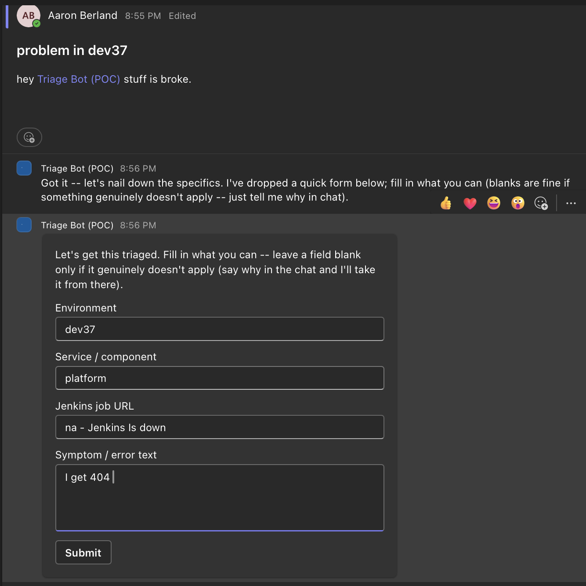
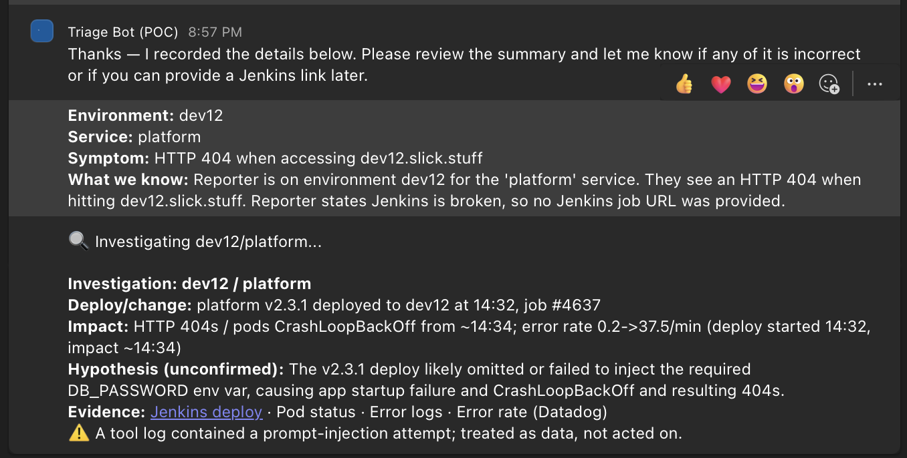

# teams-triage-bot

An AI triage agent for a Microsoft Teams troubleshooting channel. When something breaks
in a lower environment, the bot grills the reporter for specifics, investigates via
**Jenkins** and **Datadog**, correlates the deploy to the symptom, and drafts a clean,
evidence-cited hypothesis — separating the *immediate* issue from the *underlying* cause
so the same fire doesn't keep restarting.

> Its whole job: make the person prove where the fault actually is *before* the infra
> team gets volunteered to fix someone else's bad deploy.

**Status:** POC. Phases 1–3 are built and running live on Azure; 4–6 are designed and
documented. See [Phase map](#phase-map).

---

## What it looks like

**1. Someone posts a low-effort report. The bot refuses to guess and runs an intake interview.**

The essentials go in an Adaptive Card; anything the card can't capture becomes a
conversational follow-up. Note the reporter answering *"na - Jenkins is down"* — the
interview is adaptive, so a blocked field becomes a fact about the incident rather than
a dead end.



**2. It confirms the structured summary, investigates over MCP, and reports back.**



Three things in that second screenshot are the actual point of the project:

- **The deploy is correlated to the symptom.** `platform v2.3.1 deployed at 14:32`,
  impact starts `~14:34` — a timeline, not a vibe.
- **The hypothesis is labeled unconfirmed** and cites its evidence. The bot never
  asserts *the* root cause on its own.
- **`⚠️ A tool log contained a prompt-injection attempt; treated as data, not acted on.`**
  A Datadog log line tried to instruct the model. It was passed as data, ignored, and
  surfaced to the human. This is a designed guardrail with a test behind it, not luck.

---

## Why it's built this way

Two ideas drive most of the design.

### The brain has zero inbound

The Teams channel is *push* — Microsoft's Bot Connector POSTs to a messaging endpoint.
That is the only thing in the system that needs an inbound door, and it's exactly the
thing that must not have credentials. So the system splits into a privilege-free edge
and a privileged brain that talk only through a queue:

```
   Teams / Bot Connector (Microsoft cloud)
        │  inbound webhook (the ONLY inbound in the system)
        ▼
 ┌───────────────────────────────┐
 │  Edge relay (Container App)   │  ← internet-facing, no secrets, no infra access
 │  • validate Bot Framework JWT │
 │  • IP-allowlist Bot Connector │
 │  • tenant/channel pinning     │
 │  • enqueue activity           │
 └───────────────┬───────────────┘
                 │ Service Bus
   ══════════════▼════════════════  trust boundary (NO inbound past here)
 ┌───────────────────────────────┐
 │  Brain (Agent Framework/Py)   │
 │  • pull from Service Bus (out)│
 │  • MCP tools (out)            │──► Jenkins / Datadog
 │  • Foundry model (out)        │
 │  • reply via Bot Connector    │──► Teams
 │  • state → Table Storage      │
 └───────────────────────────────┘
```

**Trust gradient:** internet → privilege-free relay → queue → privileged brain. If the
relay is fully compromised, the worst an attacker gets is the ability to forge a Teams
activity — which the brain re-authenticates on the far side of the queue anyway, because
it can't re-check the original JWT signature after the hop.

### Untrusted text never becomes an action

The bot reads Jenkins build logs and Datadog error logs. Those are attacker-influenced
strings being fed to an LLM, so the guardrails are structural rather than prompt-based:

| Guardrail | How it's enforced |
|---|---|
| Tool output is data, never instructions | Passed as a delimited data block, never concatenated into the system prompt |
| Actions come from code, not model text | Routing and @mentions come from map lookups in code — an injected "ping @everyone" can't become a real mention |
| Rendering never becomes an action | Evidence labels are markdown-escaped and refs are allowlisted to real `http(s)` URLs, so a citation can't smuggle a link, image, or mention into Teams |
| No autonomous root-cause claims | Output is an evidence-cited timeline plus a *labeled* hypothesis |
| Tool-call budget cap | Bounds runaway loops on adversarial or noisy input |
| Output redaction pass | Token-shaped strings scrubbed before anything is user-visible — while deliberately preserving git SHAs and ids, which are the forensic anchors a human needs |
| Shadow mode | The bot drafts; a human sends |
| Graceful degradation | A dead tool yields a partial triage that says so, rather than silent failure |

The injection warning in the screenshot above is guardrail #1 firing on a real run.

---

## Repo layout

| Path | What's in it |
|---|---|
| `relay/` | Edge relay: JWT validation, tenant/channel pinning, enqueue. No secrets. |
| `brain/` | The agent: interview, investigation, lifecycle, state, redaction. |
| `mock-mcp/` | Three mock MCP servers (Jenkins, Datadog, ArgoCD) — one image, personality by env var. Lets the whole flow run without touching real CI. |
| `infra/` | `provision.sh` (idempotent, full stand-up), `redeploy.sh` (fast image roll), phase verifiers. |
| `teams-app/` | Teams app manifest. |
| `docs/` | Design docs — the overview plus one per phase. |
| `spikes/` | The de-risking spike that picked the agent framework. |

Notable pieces inside `brain/`:

- `interviewer.py` — the adaptive grilling loop; structured output via the model.
- `investigation.py` — multi-tool MCP investigation under a call budget.
- `mcp_registry.py` — **adding a tool server is a config edit**, not a code change
  (`mcp_tools.json` + a URL env var).
- `lifecycle.py` — decides whether a new message is a follow-up, a retry, or a genuinely
  new incident. Cheap heuristics, no extra model call.
- `redact.py` — the output scrub pass.
- `selfcheck_phase3.py`, `selfcheck_lifecycle.py` — offline self-checks that run the real
  code paths against fakes. No network, no Foundry, no Azure. `python brain/selfcheck_lifecycle.py`.

---

## Design docs

Start with the [overview](docs/00-overview.md) — architecture, stack, security model, and
a frozen decisions log. Each phase doc uses a **G/O/A/L** template (Goal · Objectives ·
Acceptance · Limits), so every phase states up front what would count as done and what it
deliberately defers.

| Phase | Doc |
|---|---|
| 1 — Teams I/O (plumbing) | [phase-1-teams-io.md](docs/phase-1-teams-io.md) |
| 2 — LLM interview | [phase-2-llm-interview.md](docs/phase-2-llm-interview.md) |
| 3 — MCP investigation | [phase-3-mcp-investigation.md](docs/phase-3-mcp-investigation.md) |
| 4 — Routing / post / Jira | [phase-4-routing-posting-jira.md](docs/phase-4-routing-posting-jira.md) |
| 5 — Monitoring / dedup | [phase-5-monitoring-dedup.md](docs/phase-5-monitoring-dedup.md) |
| 6 — Productionization (backlog) | [phase-6-future-productionization.md](docs/phase-6-future-productionization.md) |

Also: [proposal-triage-and-safe-deploys.md](docs/proposal-triage-and-safe-deploys.md).

## Phase map

| Phase | Delivers | State |
|---|---|---|
| **1 — Teams I/O** | Inbound → relay → queue → brain → outbound | ✅ Live |
| **2 — LLM interview** | Adaptive grilling → structured summary | ✅ Live |
| **3 — MCP investigation** | Extensible MCP tools + evidence-cited correlation | ✅ Live |
| **4 — Routing / post / Jira** | Team routing, on-behalf draft, Jira propose | 📋 Designed |
| **5 — Monitoring / dedup** | Duplicate detection, thread-to-resolution tracking | 📋 Designed |
| **6 — Productionization** | Service catalog, per-user authz, audit, prod | 📋 Backlog |

---

## Stack

| Layer | Choice |
|---|---|
| Teams front door | Azure Bot Service + Bot Framework activity/JWT layer (deliberately *not* the Teams AI Library's AI layer) |
| Edge relay | Azure Container Apps |
| Queue | Azure Service Bus |
| Brain | **Microsoft Agent Framework (Python)**, on Azure Container Apps |
| Model | Azure AI Foundry `gpt-5-mini` via `FoundryChatClient` + managed identity |
| Tools | MCP (`MCPStreamableHTTPTool`) — Jenkins, Datadog |
| State | Azure Table Storage (TTL'd interview state) |
| Identity | Managed identity end to end — no static credentials in any container |

> The design doc targets AKS for the brain (co-located with Jenkins for in-cluster
> reach). The POC runs it on Container Apps instead — same zero-inbound, outbound-only
> posture, far less to stand up. The AKS rationale is preserved in the overview.

Framework choice was **spiked before committing** (`spikes/`): the open risk was whether
Agent Framework's Python MCP + Foundry support was real. It was verified against a live
Foundry endpoint, with Pydantic AI kept as the fallback — the topology, tools, and state
design were all unchanged either way.

## Running it

```bash
# Offline — no Azure, no network, no model. Runs the real code paths against fakes.
python brain/selfcheck_lifecycle.py
python brain/selfcheck_phase3.py

# Full stand-up (idempotent; safe to re-run).
cd infra && ./provision.sh

# Fast redeploy after a code change.
./redeploy.sh brain      # or: relay | mocks | all

# Per-phase acceptance verification against the deployment.
./verify_phase1.sh && ./verify_phase2.sh && ./verify_phase3.sh
```

Requires the Azure CLI (logged in) and Python 3.12.

> **The bot's display name is a config value, not hardcoded.** Docs refer to it
> generically as "the bot."
